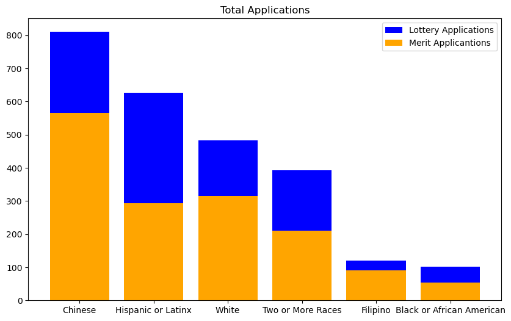

# <center>An Analysis Estimating Racial Disparities When Race Is Not Observed

This notebook's purpose is to demonstrate how disconsidering race from applications removes the delicate balance of diversity and merit of accepted applicants. Recently, my prestigious alma mater Lowell High School (San Francisco) briefly experimented with a lottery based admission system for the 2021-22 and 2022-23 school years ["citing COVID-related barriers to grades and test scores, as well as diversity concerns."<sup>(1)](https://reason.com/2022/10/12/a-top-ranked-high-school-got-rid-of-merit-based-admissions-then-students-grades-tanked/)
However, with [almost three times as many freshman failing<sup>(2)](https://www.sfchronicle.com/sf/article/lowell-high-admissions-17196603.php#:~:text=Of%20the%20620%20students%20in,figures%20obtained%20by%20The%20Chronicle.)
as previous years, they quickly decided to switch back to merit based admissions to maintain their reputation. 
    
Now that the US Supreme Court banned considering race in applications across universities, let's look at how different color-blind admission systems affect diversity and each applicants ability to succeed at that level. 


# 1. A Look at Students as a Whole

Source for data below:
https://www.usnews.com/education/best-high-schools/california/districts/san-francisco-unified-school-district/lowell-high-school-3259


```python
# 2021-2022 Total Enrollment per grade
import pandas as pd
import numpy as np
import matplotlib.pyplot as plt
seed = 42
enroll = {'Grade Level': [9, 10, 11, 12, 'Total Enrollment'],
          'Students': [649, 699, 719, 719, 2786]}
enrollment = pd.DataFrame.from_dict(enroll)
enrollment
```


<div>
<table border="1" class="dataframe">
  <thead>
    <tr style="text-align: right;">
      <th></th>
      <th>Grade Level</th>
      <th>Students</th>
    </tr>
  </thead>
  <tbody>
    <tr>
      <th>0</th>
      <td>9</td>
      <td>649</td>
    </tr>
    <tr>
      <th>1</th>
      <td>10</td>
      <td>699</td>
    </tr>
    <tr>
      <th>2</th>
      <td>11</td>
      <td>719</td>
    </tr>
    <tr>
      <th>3</th>
      <td>12</td>
      <td>719</td>
    </tr>
    <tr>
      <th>4</th>
      <td>Total Enrollment</td>
      <td>2786</td>
    </tr>
  </tbody>
</table>
</div>


```python
# 2021-2022 Enrollment by Race
num_enroll = 2786
race = [(81.7, 'Minority Enrollment'), (18.3, 'White'),
        (56.8, 'Asian'), (11.5, 'Hispanic'),
        (11.1, 'Two or More Races'), (1.7, 'Black'),
        (0.4, 'Native Hawaiian/Pacific Islander'), (0.2, 'American Indian/Alaska Native')]
races = pd.DataFrame.from_records(race)
races['Students'] = round(races[0]/100*num_enroll)
races.columns = ['Percent', 'Group', 'Students']
races = races[races.columns[[1, 0, 2]]]
races.sort_values('Students', ascending=True, inplace=True, ignore_index=True)
plt.figure(figsize=(9, 6))
plt.title('Demographics of Lowell High School (2021-2022)')
plt.barh(races['Group'].iloc[:-1], races['Students'].iloc[:-1], color='Red')
plt.xticks(rotation=50)
plt.xlabel('Number of Students', size=12)
plt.show()
(races.sort_values('Students',ascending=False, ignore_index=True))
```


    

    


<!-- <div>
<style scoped>
    .dataframe tbody tr th:only-of-type {
        vertical-align: middle;
    }

    .dataframe tbody tr th {
        vertical-align: top;
    }

    .dataframe thead th {
        text-align: right;
    }
</style>
<table border="1" class="dataframe">
  <thead>
    <tr style="text-align: right;">
      <th></th>
      <th>Group</th>
      <th>Percent</th>
      <th>Students</th>
    </tr>
  </thead>
  <tbody>
    <tr>
      <th>0</th>
      <td>Minority Enrollment</td>
      <td>81.7</td>
      <td>2276.0</td>
    </tr>
    <tr>
      <th>1</th>
      <td>Asian</td>
      <td>56.8</td>
      <td>1582.0</td>
    </tr>
    <tr>
      <th>2</th>
      <td>White</td>
      <td>18.3</td>
      <td>510.0</td>
    </tr>
    <tr>
      <th>3</th>
      <td>Hispanic</td>
      <td>11.5</td>
      <td>320.0</td>
    </tr>
    <tr>
      <th>4</th>
      <td>Two or More Races</td>
      <td>11.1</td>
      <td>309.0</td>
    </tr>
    <tr>
      <th>5</th>
      <td>Black</td>
      <td>1.7</td>
      <td>47.0</td>
    </tr>
    <tr>
      <th>6</th>
      <td>Native Hawaiian/Pacific Islander</td>
      <td>0.4</td>
      <td>11.0</td>
    </tr>
    <tr>
      <th>7</th>
      <td>American Indian/Alaska Native</td>
      <td>0.2</td>
      <td>6.0</td>
    </tr>
  </tbody>
</table>
</div> -->


```python
plt.bar(0, races.loc[[1,2], 'Students'].sum(), color='red', label = 'White/Asian')
plt.bar(1, races.loc[3:, 'Students'].sum(), color='orange', label='Other')
plt.title('White & Asian Majority')
plt.ylabel('Number of Students', size = 12)
plt.legend()
plt.show()
```


    

    


Looking at the overall numbers, the school isn't very diverse but this isn't new. The school previously attempted to be more diverse in the 90s but was sued for ["not permitting any racial/ethnic group to constitute more than 45 percent (40 percent at any "alternative school") of the school's total enrollment."<sup>(3)](https://law.justia.com/cases/federal/district-courts/FSupp/965/1316/2138871/)
    
Since COVID affected most if not all students' test scores, Lowell used this opportunity to once again try its hand at increasing diversity by implementing a lottery admission process.

# 2. Looking at Lottery vs Merit Admissions

Source for data below:
https://go.boarddocs.com/ca/sfusd/Board.nsf/files/CFERTE6F285A/%24file/Lowell_Extend%20for%202023-24_Board%20%5B6.16.22%5D-1.pdf


```python
# Lottery year numbers are average of 2021-22 and 2022-23 school year
# Non-lottery year numbers are estimates based on percentages from the 2019-20, 2020-21 school years
data = {'Race_Subgroup': ['Chinese', 'Hispanic or Latinx',
                'White', 'Two or More Races', 'Filipino',
                                  'Black or African American'],
                'Total_Apps': [810, 627, 483, 392, 121, 102],
                '%Change': [43, 113, 53, 86, 33, 92],
                '%Accepted': [43.6, 21.6, 15.7, 8.1, 4.6, 4.0],
                '%SFUSD': [35.0, 32.7, 11.4, 5.3, 4.0, 7.5],
                '%Lowell_Total_Enrolled': [48.5, 14.1, 17.7, 7.5, 5.4, 2.0]
                }
apps = pd.DataFrame.from_dict(data)
# Feature Engineering
apps['Merit_Apps'] = round(apps['Total_Apps']/(1+(apps['%Change'])/100))
apps['Num_Accepted'] = round(649*(apps['%Accepted']/100))
apps['Adt_Lotto_Apps'] = apps['Total_Apps']-apps['Merit_Apps'] # additional applications due to lottery
apps['Total_Students'] = round(2786 * (apps['%Lowell_Total_Enrolled']/100))
apps['Merit_Students'] = apps['Total_Students']-2*apps['Num_Accepted']
apps['Merit_Students/year'] = round(apps['Merit_Students']/2)
apps['%Accepted_Merit'] = apps['Merit_Students/year']/apps['Merit_Apps']*100
apps['%Accepted_Lotto'] = apps['Num_Accepted']/apps['Total_Apps']*100
apps
```


<!-- <div>
<style scoped>
    .dataframe tbody tr th:only-of-type {
        vertical-align: middle;
    }

    .dataframe tbody tr th {
        vertical-align: top;
    }

    .dataframe thead th {
        text-align: right;
    }
</style>
<table border="1" class="dataframe">
  <thead>
    <tr style="text-align: right;">
      <th></th>
      <th>Race_Subgroup</th>
      <th>Total_Apps</th>
      <th>%Change</th>
      <th>%Accepted</th>
      <th>%SFUSD</th>
      <th>%Lowell_Total_Enrolled</th>
      <th>Merit_Apps</th>
      <th>Num_Accepted</th>
      <th>Adt_Lotto_Apps</th>
      <th>Total_Students</th>
      <th>Merit_Students</th>
      <th>Merit_Students/year</th>
      <th>%Accepted_Merit</th>
      <th>%Accepted_Lotto</th>
    </tr>
  </thead>
  <tbody>
    <tr>
      <th>0</th>
      <td>Chinese</td>
      <td>810</td>
      <td>43</td>
      <td>43.6</td>
      <td>35.0</td>
      <td>48.5</td>
      <td>566.0</td>
      <td>283.0</td>
      <td>244.0</td>
      <td>1351.0</td>
      <td>785.0</td>
      <td>392.0</td>
      <td>69.257951</td>
      <td>34.938272</td>
    </tr>
    <tr>
      <th>1</th>
      <td>Hispanic or Latinx</td>
      <td>627</td>
      <td>113</td>
      <td>21.6</td>
      <td>32.7</td>
      <td>14.1</td>
      <td>294.0</td>
      <td>140.0</td>
      <td>333.0</td>
      <td>393.0</td>
      <td>113.0</td>
      <td>56.0</td>
      <td>19.047619</td>
      <td>22.328549</td>
    </tr>
    <tr>
      <th>2</th>
      <td>White</td>
      <td>483</td>
      <td>53</td>
      <td>15.7</td>
      <td>11.4</td>
      <td>17.7</td>
      <td>316.0</td>
      <td>102.0</td>
      <td>167.0</td>
      <td>493.0</td>
      <td>289.0</td>
      <td>144.0</td>
      <td>45.569620</td>
      <td>21.118012</td>
    </tr>
    <tr>
      <th>3</th>
      <td>Two or More Races</td>
      <td>392</td>
      <td>86</td>
      <td>8.1</td>
      <td>5.3</td>
      <td>7.5</td>
      <td>211.0</td>
      <td>53.0</td>
      <td>181.0</td>
      <td>209.0</td>
      <td>103.0</td>
      <td>52.0</td>
      <td>24.644550</td>
      <td>13.520408</td>
    </tr>
    <tr>
      <th>4</th>
      <td>Filipino</td>
      <td>121</td>
      <td>33</td>
      <td>4.6</td>
      <td>4.0</td>
      <td>5.4</td>
      <td>91.0</td>
      <td>30.0</td>
      <td>30.0</td>
      <td>150.0</td>
      <td>90.0</td>
      <td>45.0</td>
      <td>49.450549</td>
      <td>24.793388</td>
    </tr>
    <tr>
      <th>5</th>
      <td>Black or African American</td>
      <td>102</td>
      <td>92</td>
      <td>4.0</td>
      <td>7.5</td>
      <td>2.0</td>
      <td>53.0</td>
      <td>26.0</td>
      <td>49.0</td>
      <td>56.0</td>
      <td>4.0</td>
      <td>2.0</td>
      <td>3.773585</td>
      <td>25.490196</td>
    </tr>
  </tbody>
</table>
</div> -->


### EDA


```python
plt.figure(figsize=(10,6))
plt.bar(apps['Race_Subgroup'], apps['Total_Apps'], label = 'Lottery Applications', color='Blue')
plt.bar(apps['Race_Subgroup'], apps['Merit_Apps'], label = 'Merit Applicantions', color='Orange')
plt.xticks(rotation=0)
plt.title('Total Applications')
plt.legend()
plt.show()
```


    

    


The lottery admission process invited more than just the top quality students to apply. The results yielded double the amount of Latino and Black or African Ameritcan applicants. But what about those accepted?


```python
plt.figure(figsize=(10,6))
x = np.arange(len(apps['Race_Subgroup']))
w = 0.4
merit_sorted = apps.sort_values('%Accepted_Merit', ascending=True, ignore_index=True)
plt.barh(x+w/2, merit_sorted['%Accepted_Merit'],w, label = 'Merit Years', color='Blue')
plt.barh(x-w/2, merit_sorted['%Accepted_Lotto'],w, label = 'Lottery Years', color='#1ec712')
plt.yticks(ticks = x,labels=merit_sorted['Race_Subgroup'], rotation=0)
plt.title('Percent of Applicants Accepted by Race')
plt.xlabel('Number of Students', size=12)
plt.legend()
plt.show()
```


    

    


The percent of accepted applicants for each demographic is more balanced during the lottery years leading to vastly increased levels of diversity. Increasing diversity is not exactly the issue however. The real issue is increasing diversity in competitive environments while guaranteeing prosperity amongst all students.

Since I don't have the actual performance data, I estimated the average "scores" of each ethnic subgroup using their respective acceptance rate. Since Lowell was originally merit-based admission, I'm using the assumption that every candidate accepted had enough merit, and every candidate not accepted did not have enough merit. It's important to note it is possible for a student to have enough merit but be denied. However, since I do not have those numbers I will acknowledge and ignore that possibility. I used a standard deviation of 100 to keep the populations similar and used a "score" value of 1000 as the threshold for having enough merit to be accepted.

Source for below: https://thelowell.org/6456/features/who-gets-in-opening-up-the-lowell-admissions-controversy/

# 3. Quality vs Quantity
"It's unimportant who was
the first and who was the last.
The important thing is how many.
The rest is tokenism." - Bill Russell


```python
import scipy.stats as stats


def find_optimal_mean(probability, threshold=1000, std_dev=100):
    z_score = stats.norm.ppf(1 - probability)
    mean = threshold - z_score * std_dev
    return mean
```


```python
print('Average Scores:')
for i, prob in enumerate(apps['%Accepted_Merit']/100):
    opt_mean = round(find_optimal_mean(prob))
    print(opt_mean, apps.loc[i, 'Race_Subgroup'])
    apps.loc[i, 'Avg_score'] = opt_mean
```

    Average Scores:
    1050 Chinese
    912 Hispanic or Latinx
    989 White
    931 Two or More Races
    999 Filipino
    822 Black or African American


```python
def generate_dataframe():
    '''Generates a list of random students appropriately distributed by ethnicity'''
    # bin values to appripriately spread out number line
    bins = apps['Total_Apps'].cumsum().values
    bins = [0]+bins.tolist()

    # Generate random numbers
    random_students_merit = np.random.randint(0, int(bins[-1]), int(bins[-1]))

    # Bin generated numbers into ethnic group proportions
    assign = np.digitize(random_students_merit, bins)
    df = pd.DataFrame(assign, columns=['Race'])

    # Assign every student a random merit score based on their ethnicities acceptance rate
    df['Score'] = [np.random.normal(apps['Avg_score'][i-1], 100) for i in df['Race']]

    # Maps numbered values into string values of ethnicites
    mapping = dict(zip(range(1, 7), apps['Race_Subgroup']))
    df['Race'] = df['Race'].map(mapping)
    return df
```


```python
np.random.seed(seed)
df = generate_dataframe()
df
```


<!-- <div>
<style scoped>
    .dataframe tbody tr th:only-of-type {
        vertical-align: middle;
    }

    .dataframe tbody tr th {
        vertical-align: top;
    }

    .dataframe thead th {
        text-align: right;
    }
</style>
<table border="1" class="dataframe">
  <thead>
    <tr style="text-align: right;">
      <th></th>
      <th>Race</th>
      <th>Score</th>
    </tr>
  </thead>
  <tbody>
    <tr>
      <th>0</th>
      <td>Hispanic or Latinx</td>
      <td>1070.278725</td>
    </tr>
    <tr>
      <th>1</th>
      <td>Hispanic or Latinx</td>
      <td>939.468107</td>
    </tr>
    <tr>
      <th>2</th>
      <td>Hispanic or Latinx</td>
      <td>947.762426</td>
    </tr>
    <tr>
      <th>3</th>
      <td>Hispanic or Latinx</td>
      <td>828.268092</td>
    </tr>
    <tr>
      <th>4</th>
      <td>White</td>
      <td>939.250134</td>
    </tr>
    <tr>
      <th>...</th>
      <td>...</td>
      <td>...</td>
    </tr>
    <tr>
      <th>2530</th>
      <td>Hispanic or Latinx</td>
      <td>713.984954</td>
    </tr>
    <tr>
      <th>2531</th>
      <td>Two or More Races</td>
      <td>880.827110</td>
    </tr>
    <tr>
      <th>2532</th>
      <td>Black or African American</td>
      <td>814.846279</td>
    </tr>
    <tr>
      <th>2533</th>
      <td>Filipino</td>
      <td>934.667560</td>
    </tr>
    <tr>
      <th>2534</th>
      <td>Chinese</td>
      <td>972.845491</td>
    </tr>
  </tbody>
</table>
<p>2535 rows × 2 columns</p>
</div> -->


**Max of 650 Applicants** ([2021-2022 admitted 649 students](https://www.usnews.com/education/best-high-schools/california/districts/san-francisco-unified-school-district/lowell-high-school-3259))


```python
# Order by merit
merit = df.sort_values('Score', ascending=False, ignore_index=True)
# Select top applicants in order
merit = merit.iloc[:650]
# Look at ethnic distribution
merit['Race'].value_counts()
```


    Chinese                      402
    White                        130
    Hispanic or Latinx            48
    Two or More Races             42
    Filipino                      26
    Black or African American      2
    Name: Race, dtype: int64


```python
merit_grouped  = merit.groupby('Race').agg(['mean','median', 'count'])
merit_grouped.sort_values(('Score','count'), inplace=True, ascending=False)
merit_grouped
```


<!-- <div>
<style scoped>
    .dataframe tbody tr th:only-of-type {
        vertical-align: middle;
    }

    .dataframe tbody tr th {
        vertical-align: top;
    }

    .dataframe thead tr th {
        text-align: left;
    }

    .dataframe thead tr:last-of-type th {
        text-align: right;
    }
</style>
<table border="1" class="dataframe">
  <thead>
    <tr>
      <th></th>
      <th colspan="3" halign="left">Score</th>
    </tr>
    <tr>
      <th></th>
      <th>mean</th>
      <th>median</th>
      <th>count</th>
    </tr>
    <tr>
      <th>Race</th>
      <th></th>
      <th></th>
      <th></th>
    </tr>
  </thead>
  <tbody>
    <tr>
      <th>Chinese</th>
      <td>1135.481666</td>
      <td>1124.047279</td>
      <td>402</td>
    </tr>
    <tr>
      <th>White</th>
      <td>1108.100869</td>
      <td>1098.371501</td>
      <td>130</td>
    </tr>
    <tr>
      <th>Hispanic or Latinx</th>
      <td>1092.232079</td>
      <td>1082.504875</td>
      <td>48</td>
    </tr>
    <tr>
      <th>Two or More Races</th>
      <td>1095.262939</td>
      <td>1081.736167</td>
      <td>42</td>
    </tr>
    <tr>
      <th>Filipino</th>
      <td>1124.496697</td>
      <td>1113.846940</td>
      <td>26</td>
    </tr>
    <tr>
      <th>Black or African American</th>
      <td>1077.132765</td>
      <td>1077.132765</td>
      <td>2</td>
    </tr>
  </tbody>
</table>
</div> -->


```python
plt.figure(figsize=(9,5))
merit_grouped.sort_values(('Score','count'), inplace=True, ascending=True)
plt.barh(merit_grouped.index, merit_grouped['Score','count'],color='red')
plt.xticks(rotation=50)
plt.title('Number of Student Accepted under Merit')
plt.show()
```


    

    


```python
plt.bar(0, merit_grouped['Score','count'].iloc[[1,5]].sum(), color='red', label = 'White/Asian')
plt.bar(1, merit_grouped['Score','count'].iloc[[0,2,3,4]].sum(), color='orange', label='Other')
plt.title('White & Asian Majority under Merit')
plt.ylabel('Number of Students', size = 12)
plt.legend()
plt.show()
```


    

    


With only using merit as the admission system, we can see Chinese dominate the pool and Latinos and African Americans combine for only 50 accepted students which is 1/8th the number of Chinese students and only 1/13th of the entire incoming student population.

The lottery admission process is suppose to be more diverse since it gives every applicant an equal chance at getting accepted. Let's look at an example.


```python
np.random.seed(seed)
lotto = df.copy()

# Randomly pick 650 students to be accepted
lotto.loc[np.random.permutation(len(lotto))[:650],'Accepted'] = 1

# Fill non-selected students NaN with 0
lotto['Accepted'].fillna(0, inplace=True) # Not technically necessary since we drop them later

# Drop all students not "accepted"
lotto = lotto[lotto['Accepted']==1].reset_index(drop=True)

# Create a column for if the accepted student would've got accepted under merit
lotto['Has_Merit'] = lotto['Score']>=1000
lotto
```


<!-- <div>
<style scoped>
    .dataframe tbody tr th:only-of-type {
        vertical-align: middle;
    }

    .dataframe tbody tr th {
        vertical-align: top;
    }

    .dataframe thead th {
        text-align: right;
    }
</style>
<table border="1" class="dataframe">
  <thead>
    <tr style="text-align: right;">
      <th></th>
      <th>Race</th>
      <th>Score</th>
      <th>Accepted</th>
      <th>Has_Merit</th>
    </tr>
  </thead>
  <tbody>
    <tr>
      <th>0</th>
      <td>Hispanic or Latinx</td>
      <td>830.664535</td>
      <td>1.0</td>
      <td>False</td>
    </tr>
    <tr>
      <th>1</th>
      <td>Chinese</td>
      <td>937.609853</td>
      <td>1.0</td>
      <td>False</td>
    </tr>
    <tr>
      <th>2</th>
      <td>White</td>
      <td>1084.685688</td>
      <td>1.0</td>
      <td>True</td>
    </tr>
    <tr>
      <th>3</th>
      <td>Chinese</td>
      <td>1144.428964</td>
      <td>1.0</td>
      <td>True</td>
    </tr>
    <tr>
      <th>4</th>
      <td>Two or More Races</td>
      <td>845.065972</td>
      <td>1.0</td>
      <td>False</td>
    </tr>
    <tr>
      <th>...</th>
      <td>...</td>
      <td>...</td>
      <td>...</td>
      <td>...</td>
    </tr>
    <tr>
      <th>645</th>
      <td>Chinese</td>
      <td>1005.220245</td>
      <td>1.0</td>
      <td>True</td>
    </tr>
    <tr>
      <th>646</th>
      <td>Chinese</td>
      <td>886.029088</td>
      <td>1.0</td>
      <td>False</td>
    </tr>
    <tr>
      <th>647</th>
      <td>Chinese</td>
      <td>1055.341748</td>
      <td>1.0</td>
      <td>True</td>
    </tr>
    <tr>
      <th>648</th>
      <td>Black or African American</td>
      <td>814.846279</td>
      <td>1.0</td>
      <td>False</td>
    </tr>
    <tr>
      <th>649</th>
      <td>Filipino</td>
      <td>934.667560</td>
      <td>1.0</td>
      <td>False</td>
    </tr>
  </tbody>
</table>
<p>650 rows × 4 columns</p>
</div> -->


```python
lotto_grouped = lotto.groupby('Race').agg({'Score':['mean','median', 'count'], 'Has_Merit':'sum'})
lotto_grouped.sort_values(('Score','count'), ascending=False, inplace=True)
lotto_grouped
```


<!-- <div>
<style scoped>
    .dataframe tbody tr th:only-of-type {
        vertical-align: middle;
    }

    .dataframe tbody tr th {
        vertical-align: top;
    }

    .dataframe thead tr th {
        text-align: left;
    }

    .dataframe thead tr:last-of-type th {
        text-align: right;
    }
</style>
<table border="1" class="dataframe">
  <thead>
    <tr>
      <th></th>
      <th colspan="3" halign="left">Score</th>
      <th>Has_Merit</th>
    </tr>
    <tr>
      <th></th>
      <th>mean</th>
      <th>median</th>
      <th>count</th>
      <th>sum</th>
    </tr>
    <tr>
      <th>Race</th>
      <th></th>
      <th></th>
      <th></th>
      <th></th>
    </tr>
  </thead>
  <tbody>
    <tr>
      <th>Chinese</th>
      <td>1046.959315</td>
      <td>1055.341748</td>
      <td>211</td>
      <td>148</td>
    </tr>
    <tr>
      <th>Hispanic or Latinx</th>
      <td>903.737118</td>
      <td>900.594083</td>
      <td>155</td>
      <td>23</td>
    </tr>
    <tr>
      <th>White</th>
      <td>976.325444</td>
      <td>976.324140</td>
      <td>128</td>
      <td>54</td>
    </tr>
    <tr>
      <th>Two or More Races</th>
      <td>939.118281</td>
      <td>942.003309</td>
      <td>105</td>
      <td>31</td>
    </tr>
    <tr>
      <th>Filipino</th>
      <td>1026.224291</td>
      <td>1024.569380</td>
      <td>30</td>
      <td>19</td>
    </tr>
    <tr>
      <th>Black or African American</th>
      <td>808.957579</td>
      <td>792.928926</td>
      <td>21</td>
      <td>1</td>
    </tr>
  </tbody>
</table>
</div> -->


```python
plt.figure(figsize=(9,5))
lotto_grouped.sort_values(('Score','count'), ascending=True, inplace=True)
plt.barh(lotto_grouped.index, lotto_grouped['Score','count'],color='red')
plt.xticks(rotation=50)
plt.title('Number of Student Accepted under Lottery')
plt.show()
```


    

    


```python
plt.bar(0, lotto_grouped['Score','count'].iloc[[1,5]].sum(), color='red', label = 'White/Asian')
plt.bar(1, lotto_grouped['Score','count'].iloc[[0,2,3,4]].sum(), color='orange', label='Other')
plt.title('White & Asian Minority under Lottery')
plt.ylabel('Number of Students', size = 12)
plt.legend()
plt.show()
```


    

    


We can see here under the lottery admission system, Latino and African American students would now make up 176 of the incoming class which would be a little more than a quarter of the population but the issue comes with their merit. Only one of the 21 African American students has the merit and one in every 7 Latino students have merit while Whites and Chinese have roughly half and 2/3rds resepectively. This doesn't mean anyone is doomed for failure per se, but it does mean they'll have a much harder time succeeding than their peers which may lead to reduced confidence and dropouts which can also have an residual impact on students similar to them. It is also important to note many Latino and African American students don't apply to Lowell since it historically doesn't accept many people that look like them. 

Let's add one more admission process, something similar to the now banned affirmative action where we take into consideration race and merit. In the real world this would be a much more holistic review but in this simulation space we only have race and merit.

A big question when it comes to affirmative action is to what extent to consider things other than merit. In my example I will use the same distribution as the lottery process since it in theory should give an equal opportunity to get accepted. 


```python
lotto_numbers = lotto_grouped['Score', 'count']
lotto_numbers
```


    Race
    Black or African American     21
    Filipino                      30
    Two or More Races            105
    White                        128
    Hispanic or Latinx           155
    Chinese                      211
    Name: (Score, count), dtype: int64


```python
lotto_numbers.index
```


    Index(['Black or African American', 'Filipino', 'Two or More Races', 'White',
           'Hispanic or Latinx', 'Chinese'],
          dtype='object', name='Race')


```python
# Sort by merit
action = df[df['Score']>=1000].sort_values('Score', ascending=False).reset_index(drop=True)
buffer = 19 # added to reach ~650 students accepted

# Get top x students from each race to fit distribution
filters = [action[action['Race']==x].iloc[:lotto_numbers[x]+buffer] for x in lotto_numbers.index]
action = pd.concat(filters, ignore_index=True)
action['Has_Merit'] = (action['Score']>1000)
action
```


<!-- <div>
<style scoped>
    .dataframe tbody tr th:only-of-type {
        vertical-align: middle;
    }

    .dataframe tbody tr th {
        vertical-align: top;
    }

    .dataframe thead th {
        text-align: right;
    }
</style>
<table border="1" class="dataframe">
  <thead>
    <tr style="text-align: right;">
      <th></th>
      <th>Race</th>
      <th>Score</th>
      <th>Has_Merit</th>
    </tr>
  </thead>
  <tbody>
    <tr>
      <th>0</th>
      <td>Black or African American</td>
      <td>1089.351097</td>
      <td>True</td>
    </tr>
    <tr>
      <th>1</th>
      <td>Black or African American</td>
      <td>1064.914432</td>
      <td>True</td>
    </tr>
    <tr>
      <th>2</th>
      <td>Black or African American</td>
      <td>1024.580709</td>
      <td>True</td>
    </tr>
    <tr>
      <th>3</th>
      <td>Black or African American</td>
      <td>1023.203413</td>
      <td>True</td>
    </tr>
    <tr>
      <th>4</th>
      <td>Black or African American</td>
      <td>1001.632393</td>
      <td>True</td>
    </tr>
    <tr>
      <th>...</th>
      <td>...</td>
      <td>...</td>
      <td>...</td>
    </tr>
    <tr>
      <th>644</th>
      <td>Chinese</td>
      <td>1115.635745</td>
      <td>True</td>
    </tr>
    <tr>
      <th>645</th>
      <td>Chinese</td>
      <td>1115.449249</td>
      <td>True</td>
    </tr>
    <tr>
      <th>646</th>
      <td>Chinese</td>
      <td>1115.410560</td>
      <td>True</td>
    </tr>
    <tr>
      <th>647</th>
      <td>Chinese</td>
      <td>1115.350195</td>
      <td>True</td>
    </tr>
    <tr>
      <th>648</th>
      <td>Chinese</td>
      <td>1115.116146</td>
      <td>True</td>
    </tr>
  </tbody>
</table>
<p>649 rows × 3 columns</p>
</div> -->


```python
action_grouped = action.groupby('Race').agg({'Score':['mean','median', 'count'], 'Has_Merit':'sum'})
action_grouped
```


<!-- <div>
<style scoped>
    .dataframe tbody tr th:only-of-type {
        vertical-align: middle;
    }

    .dataframe tbody tr th {
        vertical-align: top;
    }

    .dataframe thead tr th {
        text-align: left;
    }

    .dataframe thead tr:last-of-type th {
        text-align: right;
    }
</style>
<table border="1" class="dataframe">
  <thead>
    <tr>
      <th></th>
      <th colspan="3" halign="left">Score</th>
      <th>Has_Merit</th>
    </tr>
    <tr>
      <th></th>
      <th>mean</th>
      <th>median</th>
      <th>count</th>
      <th>sum</th>
    </tr>
    <tr>
      <th>Race</th>
      <th></th>
      <th></th>
      <th></th>
      <th></th>
    </tr>
  </thead>
  <tbody>
    <tr>
      <th>Black or African American</th>
      <td>1040.736409</td>
      <td>1024.580709</td>
      <td>5</td>
      <td>5</td>
    </tr>
    <tr>
      <th>Chinese</th>
      <td>1176.755684</td>
      <td>1168.210895</td>
      <td>230</td>
      <td>230</td>
    </tr>
    <tr>
      <th>Filipino</th>
      <td>1082.943520</td>
      <td>1057.395499</td>
      <td>49</td>
      <td>49</td>
    </tr>
    <tr>
      <th>Hispanic or Latinx</th>
      <td>1052.289422</td>
      <td>1043.429501</td>
      <td>117</td>
      <td>117</td>
    </tr>
    <tr>
      <th>Two or More Races</th>
      <td>1051.524965</td>
      <td>1038.539345</td>
      <td>101</td>
      <td>101</td>
    </tr>
    <tr>
      <th>White</th>
      <td>1101.077765</td>
      <td>1094.874383</td>
      <td>147</td>
      <td>147</td>
    </tr>
  </tbody>
</table>
</div> -->


Here we can see that only did we have more diversity than merit only, but every student is completely capable of succeeding since they all qualify under the original merit definition. It is also important to note that this method only selected 592 students and an additional 19 students of each race (with merit) needed to be selected to hit the target goal.
### More EDA


```python
df_grouped = df.copy()
df_grouped['Has_Merit'] = (df['Score']>=1000)+0
df_grouped = df_grouped.groupby('Race').agg({'Score':['mean','median', 'count'], 'Has_Merit':'sum'})
df_grouped
```


<!-- <div>
<style scoped>
    .dataframe tbody tr th:only-of-type {
        vertical-align: middle;
    }

    .dataframe tbody tr th {
        vertical-align: top;
    }

    .dataframe thead tr th {
        text-align: left;
    }

    .dataframe thead tr:last-of-type th {
        text-align: right;
    }
</style>
<table border="1" class="dataframe">
  <thead>
    <tr>
      <th></th>
      <th colspan="3" halign="left">Score</th>
      <th>Has_Merit</th>
    </tr>
    <tr>
      <th></th>
      <th>mean</th>
      <th>median</th>
      <th>count</th>
      <th>sum</th>
    </tr>
    <tr>
      <th>Race</th>
      <th></th>
      <th></th>
      <th></th>
      <th></th>
    </tr>
  </thead>
  <tbody>
    <tr>
      <th>Black or African American</th>
      <td>826.775674</td>
      <td>829.176343</td>
      <td>97</td>
      <td>5</td>
    </tr>
    <tr>
      <th>Chinese</th>
      <td>1050.696620</td>
      <td>1052.537852</td>
      <td>808</td>
      <td>550</td>
    </tr>
    <tr>
      <th>Filipino</th>
      <td>1002.503198</td>
      <td>1010.068241</td>
      <td>109</td>
      <td>58</td>
    </tr>
    <tr>
      <th>Hispanic or Latinx</th>
      <td>909.623109</td>
      <td>914.072019</td>
      <td>644</td>
      <td>117</td>
    </tr>
    <tr>
      <th>Two or More Races</th>
      <td>933.347524</td>
      <td>932.017507</td>
      <td>403</td>
      <td>101</td>
    </tr>
    <tr>
      <th>White</th>
      <td>987.502835</td>
      <td>984.931896</td>
      <td>474</td>
      <td>216</td>
    </tr>
  </tbody>
</table>
</div> -->


```python
lotto_grouped.sort_index(ascending=False, inplace=True)
action_grouped.sort_index(ascending=False, inplace=True)
merit_grouped.sort_index(ascending=False, inplace=True)
x = np.arange(len(lotto_grouped['Score', 'count'].index))
w = 0.2
plt.figure(figsize=(14,6))
plt.title('Number of Accepted Students by Race')
plt.bar(x-w, lotto_grouped['Score', 'count'],w, label = 'Lottery', color='Blue')
plt.bar(x-w, lotto_grouped['Has_Merit', 'sum'],w, label = 'Has Merit', color='#0586ff')
plt.bar(x, action_grouped['Score', 'count'],w, label = 'Affirmative Action', color='red')
plt.bar(x+w, merit_grouped['Score', 'count'],w, label = 'Merit', color='#1ec712')
plt.xticks(x, labels=lotto_grouped['Score', 'count'].index, rotation=0)
plt.legend()
plt.show()
```


    

    


```python
df_grouped.sort_index(ascending=False, inplace=True)

x = np.arange(len(lotto_grouped['Score', 'count'].index))
w = 0.20
plt.figure(figsize=(14,6))
plt.title('Proportion of Applicants by Race Accepted')

plt.bar(x-w, lotto_grouped['Score', 'count']/df_grouped['Score', 'count'],w, label = 'Lottery', color='Blue')
plt.bar(x-w, lotto_grouped['Has_Merit', 'sum']/df_grouped['Score', 'count'],w, label = 'Has Merit', color='#0586ff')
plt.bar(x, action_grouped['Score', 'count']/df_grouped['Score', 'count'],w, label = 'Affirmative Action', color='red')
plt.bar(x+w, merit_grouped['Score', 'count']/df_grouped['Score', 'count'],w, label = 'Merit', color='#1ec712')
plt.xticks(x, labels=lotto_grouped['Score', 'count'].index, rotation=0)
plt.legend()
plt.show()
```


    

    


# 4. Summary

Disregarding race from applications as demonstrated removes the ability to ensure a diverse and successful crop of accepted applicants. Minorities will either lack in numbers, or lack success compared to their peers with access to more support and resources.

Although race is being removed from consideration, holistic review as a whole is still possible which allows students with more difficult upbringings to be properly evaluated with context. In practice, this often doesn't solve the issue at hand due to stigmas, cultural connotations around trauma, and systematic racist. As a Chinese descendent myself, all of my family speaks about their lives and experiences that have once or recently caused them great pain. To quote arist J. Cole of African American descent "[There's all sorts of trauma from drama that children see, type of [things] that normally would call for therapy. But you know just how it go in our community, keep that [stuff] inside it don't matter how hard it be"<sup>(4)](https://genius.com/J-cole-friends-lyrics)

Although this is anecdotal evidence from a song, J. Cole speaks about how children in his community don't speak up about the traumas and difficulties they may face while growing up. With this in mind, taking a holistic review of each applicant only includes what the applicant is willing and able to reveal. Using the previous two pieces of anecdotal evidence, Chinese and White students may have an easier time presenting their hardships in their applications than African American students. There is also an argument to be made that living in America as an African American person is much harder than living as an Asian American and many children that experience systematic racist and microaggressions due to their darker complexion may think that's just how life goes.

Either way you slice it, disconsidering race predominantly disadvantages minority applicants by removing a large piece of their holistic review. It also prevents admission officers from understanding unspoken challenges students of color face on a regular basis. 
    
Although I don't agree in this ruling by the Supreme Court, if this motion truly lacked racist intent, I think banning legacy status from admissions is the only fair thing to do since that is affirmative action but for privileged rich kids which discriminates against **all** other applicants.
    
    

# <center>Works Cited</center>
(In order of appearance)

1. Camp, Emma. "A Top-Ranked High School Got Rid of Merit-Based Admissions. Then Students' Grades Tanked." reason, October 12, 2022, https://reason.com/2022/10/12/a-top-ranked-high-school-got-rid-of-merit-based-admissions-then-students-grades-tanked/

2. Cano, Ricardo, and Nenette Asimov. "New data shows shift at Lowell High School. More students given failing grades after admissions change." sfchronicle, May 25, 2022, https://www.sfchronicle.com/sf/article/lowell-high-admissions-17196603.php#:~:text=Of%20the%20620%20students%20in,figures%20obtained%20by%20The%20Chronicle

3. Ho by Ho v. San Francisco Unified School Dist., 965 F. Supp. 1316 (N.D. Cal. 1997). May 5, 1997, https://law.justia.com/cases/federal/district-courts/FSupp/965/1316/2138871/


4. J. Cole, "FRIENDS", KOD, 2018, https://genius.com/J-cole-friends-lyrics


```python

```
